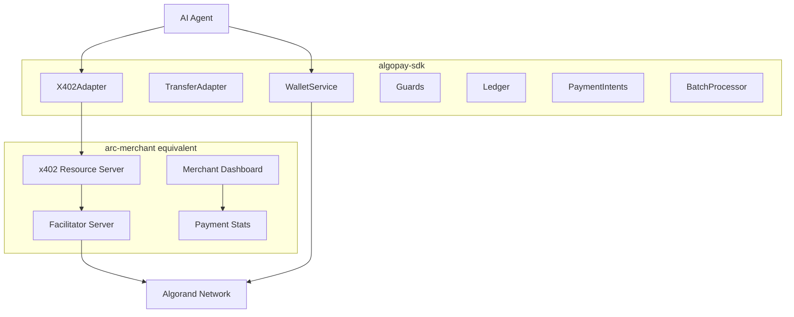

# AlgoPay SDK: OmniAgentPay Port for Algorand

## Executive Summary

This plan maps OmniAgentPay features one-to-one to Algorand equivalents and defines what belongs in **algopay-sdk** vs the **arc-merchant equivalent** (separate project). Algorand has native x402 support, USDC as ASA (ID 31566704), and instant finality—but lacks Circle's developer-controlled wallets and CCTP. We build a custom wallet layer and omit cross-chain for MVP.

**Scope note:** Phases 1–4 implement the **Python SDK** only. **TypeScript SDK** and the **documentation website** are planned as follow-on work (Phases 5–6)—not part of the initial build unless explicitly prioritized.

---

## Feature Mapping: OmniAgentPay → Algorand

### 1. Wallet Layer (Circle → Custom Build)


| OmniAgentPay (Circle) | Algorand Equivalent               | Approach                                                                                          |
| --------------------- | --------------------------------- | ------------------------------------------------------------------------------------------------- |
| Wallet Sets           | N/A (Algorand has no wallet sets) | **SDK**: Use logical grouping (e.g., `wallet_group_id`) for multi-tenant guard scoping            |
| Create Wallet         | Generate Algorand account         | **SDK**: `algosdk.generate_account()` or AlgoKit; store mnemonic/private key in pluggable storage |
| List/Get Wallet       | Local storage lookup              | **SDK**: WalletService backed by memory/Redis/file storage                                        |
| Get Balances          | Indexer or algod                  | **SDK**: `indexer.lookup_account_balances(address)` or `algod.account_info()`                     |
| USDC Balance          | ASA balance (asset ID 31566704)   | **SDK**: Filter balances by USDCa ASA ID                                                          |
| Transfer USDC         | ASA transfer (axfer)              | **SDK**: Build `axfer` transaction, sign, submit via `algod.send_transaction()`                   |
| Contract Execution    | N/A for direct transfers          | Algorand uses native `axfer`; no approve/transferFrom pattern                                     |


**Circle Equivalent to Build in SDK:**

- **WalletService**: Generate keys, store in pluggable backend (memory, Redis, encrypted file), sign transactions programmatically
- **Key Storage**: Use `algosdk.mnemonic_to_private_key()`; store encrypted or in KMD (AlgoKit) for production
- **Transaction Submission**: `algod.send_transaction()` with signed `SignedTransaction`

**References:** [Algorand Python docs](https://algorandfoundation.github.io/puya/), [AlgoKit](https://github.com/algorandfoundation/algokit), algosdk

---

### 2. Payment Protocols

#### 2a. TransferAdapter (Direct USDC)


| OmniAgentPay                   | Algorand                                  | Implementation                                       |
| ------------------------------ | ----------------------------------------- | ---------------------------------------------------- |
| `create_transfer` (Circle API) | `axfer` transaction                       | **SDK**: Build `PaymentTxn`-like axfer, sign, submit |
| Token ID                       | ASA ID 31566704 (mainnet) / testnet USDCa | **SDK**: Configurable `USDC_ASA_ID` per network      |
| Recipient                      | EVM address                               | Algorand address (58-char base32)                    |


**SDK**: `TransferAdapter` — same logic, swap Circle client for Algorand `WalletService` + `algod`.

#### 2b. X402Adapter (HTTP 402)


| OmniAgentPay         | Algorand                                | Implementation                                                           |
| -------------------- | --------------------------------------- | ------------------------------------------------------------------------ |
| 402 response parsing | Same (HTTP 402 + `paymentRequirements`) | **SDK**: Reuse `PaymentRequirements` / `PaymentPayload` structure        |
| Payment proof        | `PAYMENT-SIGNATURE` header with tx hash | Algorand: `paymentGroup` + `paymentIndex` (see scheme_exact_algo)        |
| Same-chain transfer  | Circle `create_transfer`                | **SDK**: Build atomic group with axfer; optionally include `feePayer` tx |
| Cross-chain          | GatewayAdapter (CCTP)                   | **Deferred**: Algorand has no CCTP; Wormhole exists but is different     |


**Algorand x402 Scheme (scheme_exact_algo):**

- `paymentRequirements.asset` = ASA ID (not ERC20 address)
- `paymentRequirements.extra.feePayer` = optional facilitator address for gasless
- `PAYMENT-SIGNATURE.payload.paymentGroup` = array of base64 msgpack-encoded transactions
- `PAYMENT-SIGNATURE.payload.paymentIndex` = index of the axfer in the group

**SDK**: Use [x402-avm](https://pypi.org/project/x402-avm/) Python packages:

- `x402-avm` (core + AVM) for building/signing payment groups
- `x402-avm` with `httpx` for client flow

**Flow:** GET URL → 402 → parse requirements → build paymentGroup (axfer + optional feePayer) → sign → retry with `PAYMENT-SIGNATURE` → 200 + resource.

#### 2c. GatewayAdapter (CCTP Cross-Chain)


| OmniAgentPay                   | Algorand | Approach                      |
| ------------------------------ | -------- | ----------------------------- |
| CCTP burn → attestation → mint | N/A      | Algorand is not a CCTP domain |


**Decision:** Omit `GatewayAdapter` from MVP. Algorand is single-chain for USDCa. Future: optional Wormhole/Allbridge bridge adapter (separate module).

---

### 3. Guards (Framework-Agnostic)


| Guard          | OmniAgentPay                            | Algorand                     | Location |
| -------------- | --------------------------------------- | ---------------------------- | -------- |
| BudgetGuard    | daily/hourly/total limits               | Same                         | **SDK**  |
| RateLimitGuard | tx/min, tx/hour, tx/day                 | Same                         | **SDK**  |
| RecipientGuard | whitelist/blacklist addresses + domains | Same (Algorand addrs + URLs) | **SDK**  |
| SingleTxGuard  | max/min per tx                          | Same                         | **SDK**  |
| ConfirmGuard   | threshold / always                      | Same (human-in-the-loop)     | **SDK**  |


**SDK**: Port guards as-is; they are protocol-agnostic. Storage backend (memory/Redis) unchanged.

---

### 4. Payment Intents, Ledger, Batch, Storage


| Feature              | OmniAgentPay                | Algorand                         | Location |
| -------------------- | --------------------------- | -------------------------------- | -------- |
| PaymentIntentService | authorize → capture         | Same                             | **SDK**  |
| Ledger               | record, update_status, sync | Same; sync uses Algorand indexer | **SDK**  |
| BatchProcessor       | concurrent payments         | Same                             | **SDK**  |
| Storage              | memory, Redis               | Same                             | **SDK**  |


**SDK**: Port directly. For `sync_transaction`, use Algorand indexer `lookup_transaction(tx_id)` instead of Circle API.

---

### 5. Webhooks


| OmniAgentPay           | Algorand | Approach                              |
| ---------------------- | -------- | ------------------------------------- |
| Circle webhook parsing | N/A      | Algorand has no Circle-style webhooks |


**Decision:** Omit webhook parser from SDK. Merchants can use Algorand indexer subscriptions or custom indexer webhooks (e.g., [Algorand Indexer](https://developer.algorand.org/docs/rest-apis/indexer/)) in the merchant app.

---

## SDK vs Arc-Merchant Equivalent Boundary




| Component                                    | In SDK | In Merchant App                             |
| -------------------------------------------- | ------ | ------------------------------------------- |
| Wallet creation, signing, transfers          | Yes    | No (merchant uses own wallet for receiving) |
| x402 **client** (pay for URL)                | Yes    | No                                          |
| x402 **resource server** (protect endpoints) | No     | Yes                                         |
| Facilitator (verify + settle)                | No     | Yes                                         |
| Guards, ledger, intents, batch               | Yes    | No                                          |
| Dashboard, stats, payment tracking           | No     | Yes                                         |


**Facilitator:** The merchant app runs a facilitator that implements [scheme_exact_algo](https://github.com/coinbase/x402/blob/main/specs/schemes/exact/scheme_exact_algo.md): verify `paymentGroup`, optionally sign `feePayer` tx, simulate, submit. Use [Algorand Facilitator](https://facilitator.goplausible.xyz/) as reference or [x402-avm Express/Hono](https://www.npmjs.com/package/@x402-avm/express) for self-hosted.

---

## What to Build in SDK (algopay-sdk)

### Core Modules

1. `**algopay/core/`**
  - `config.py` — `algod_url`, `indexer_url`, `network` (mainnet/testnet), `usdc_asa_id`
  - `algorand_client.py` — thin wrapper over `algod` + `indexer` (algosdk)
  - `exceptions.py`, `types.py`, `logging.py` — port from omniagentpay
2. `**algopay/wallet/`**
  - `service.py` — **WalletService** (replaces CircleClient):
    - `create_wallet()` — generate account, store in storage
    - `list_wallets()`, `get_wallet()`, `get_balances()`, `get_usdc_balance()`
    - `transfer()` — build axfer, sign, submit, optionally wait for confirmation
  - `storage.py` — pluggable: memory, Redis, encrypted file (for mnemonics/keys)
3. `**algopay/protocols/`**
  - `base.py` — `ProtocolAdapter` ABC (unchanged)
  - `transfer.py` — **TransferAdapter** (direct ASA transfer)
  - `x402.py` — **X402Adapter** using x402-avm + scheme_exact_algo:
    - Parse 402, build `paymentGroup` (axfer + optional feePayer)
    - Sign via WalletService, retry with `PAYMENT-SIGNATURE`
4. `**algopay/guards/`** — port all guards (budget, rate_limit, recipient, single_tx, confirm)
5. `**algopay/ledger/`** — port Ledger; `sync_transaction` uses indexer
6. `**algopay/intents/`** — port PaymentIntentService
7. `**algopay/payment/`** — router, batch processor (adapters swapped)
8. `**algopay/client.py`** — **AlgoPay** main client (same API surface as OmniAgentPay where applicable)

### Dependencies

- `algosdk` — algod, indexer, transaction building, signing
- `x402-avm` — x402 client + AVM scheme for Algorand
- `httpx` — async HTTP for x402
- `pydantic`, `python-dotenv`, `cryptography`, `redis` — same as omniagentpay

### Network Types

- `Network.ALGORAND_MAINNET`, `Network.ALGORAND_TESTNET` (replace EVM networks)
- USDCa ASA IDs: mainnet `31566704`, testnet (look up from [Algorand developer portal](https://developer.algorand.org/))

---

## What to Leave for Arc-Merchant Equivalent


| Component                | Responsibility                                                              |
| ------------------------ | --------------------------------------------------------------------------- |
| **Facilitator**          | Verify `paymentGroup`, sign feePayer, simulate, submit to Algorand          |
| **x402 Resource Server** | Protect endpoints with 402, call facilitator verify/settle                  |
| **Merchant Dashboard**   | Balance, recent payments, article stats                                     |
| **Payment Stats**        | Record payments, update txHash when settled                                 |
| **Merchant Wallet**      | Receiving address for `payTo`; can be generated via algopay-sdk or separate |


The merchant app will depend on:

- `algopay-sdk` (optional) for wallet utilities if it needs to create/manage merchant wallets
- `@x402-avm/express` or `@x402-avm/next` for resource server
- Algorand Facilitator (self-hosted or GoPlausible) for verify/settle

---

## Circle Equivalent Features: Build vs Defer


| Feature                      | Build in SDK                                              | Defer / Merchant                           |
| ---------------------------- | --------------------------------------------------------- | ------------------------------------------ |
| Developer-controlled wallets | **Yes** — custom WalletService with key storage + signing | —                                          |
| CCTP cross-chain             | **No** — Algorand has no CCTP                             | Future: Wormhole adapter (optional module) |
| Webhooks                     | **No**                                                    | Merchant: indexer webhooks or polling      |
| Gasless (fee payer)          | **Yes** — x402 `feePayer` in paymentGroup                 | Facilitator signs feePayer                 |


---

## Recommended Project Structure

```
algopay-sdk/
├── src/algopay/
│   ├── __init__.py
│   ├── client.py              # AlgoPay main client
│   ├── core/
│   │   ├── algorand_client.py # algod + indexer wrapper
│   │   ├── config.py
│   │   ├── exceptions.py
│   │   ├── types.py           # Network.ALGORAND_*, etc.
│   │   └── constants.py       # USDC_ASA_ID, etc.
│   ├── wallet/
│   │   ├── service.py         # WalletService
│   │   └── storage/           # memory, redis, file
│   ├── protocols/
│   │   ├── base.py
│   │   ├── transfer.py
│   │   └── x402.py
│   ├── guards/                # port from omniagentpay
│   ├── ledger/
│   ├── intents/
│   ├── payment/
│   └── storage/
├── tests/
├── examples/
├── pyproject.toml
└── README.md
```

*(Future: add `packages/typescript/` for Phase 5 and `docs/` for Phase 6—or adopt the optional monorepo layout above.)*

---

## Implementation Order

1. **Phase 1 — Core + Wallet + Transfer**
  - Config, types, Algorand client
  - WalletService with memory storage
  - TransferAdapter (direct ASA)
2. **Phase 2 — x402**
  - Integrate x402-avm
  - X402Adapter (client flow)
3. **Phase 3 — Guards, Ledger, Intents, Batch**
  - Port guards, ledger, intents, batch
  - AlgoPay client wiring
4. **Phase 4 — Polish**
  - Redis storage, testnet faucet integration
  - Examples (basic_payment, x402_client_demo)
5. **Phase 5 — TypeScript SDK (future)**
6. **Phase 6 — Documentation website (future)**

---

## Future: TypeScript SDK (Phase 5)

**Goal:** Feature parity with the Python SDK for Algorand agents and apps on the TypeScript/JavaScript stack (Next.js, Node, Vercel AI SDK, MCP servers—similar to how **arc-merchant** tools use `@circle-fin` today, but without Circle).

**Suggested approach:**

- **Package:** e.g. `@algopay/sdk` (or scoped `packages/algopay-ts` in a monorepo alongside Python).
- **Stack alignment:** Compose with the official Algorand x402 stack already documented for TS:
  - `@x402-avm/core`, `@x402-avm/avm`, `@x402-avm/fetch` (or axios)—for x402 client + Algorand `paymentGroup` flows ([x402 on Algorand](https://algorand.co/agentic-commerce/x402/developers)).
  - `algosdk` for algod/indexer, transaction building, signing, and atomic groups.
- **Mirror Python surface:** Same conceptual modules—`WalletService` (key storage abstraction), `TransferAdapter`, `X402Adapter`, guards, ledger, intents, batch, main `AlgoPay` client—so documentation and examples can be translated one-to-one.
- **Security:** Key material in TS still requires secure storage (env, KMS, encrypted file, or hardware); document threat model same as Python.
- **Testing:** Contract/API tests against Algorand testnet + shared fixtures with Python where possible.

**Deliverables:** npm package, README, examples mirroring Python `examples/`, and CI (lint, test, publish).

---

## Future: Documentation website (Phase 6)

**Goal:** First-class docs for developers using AlgoPay on Algorand—not only README files.

**Suggested stack (pick one during Phase 6):**

- **Docusaurus** or **VitePress** or **Starlight (Astro)**—good for versioned docs, search, and API reference links.
- **MkDocs Material**—strong if you prefer Python-centric authoring and hosting on GitHub Pages.

**Content to include:**

- Quickstart (testnet, faucet, env vars, first transfer).
- Architecture (wallet storage, x402 flow vs facilitator vs merchant app).
- API reference generated from Python (e.g. Sphinx/autodoc or `mkdocstrings`) and from TS (TypeDoc)—or hand-curated reference pages if automation is deferred.
- Guides: guards, payment intents, batch pays, integrating with AI agents (tool patterns).
- Links to [scheme_exact_algo](https://github.com/coinbase/x402/blob/main/specs/schemes/exact/scheme_exact_algo.md), [AlgoBharat dev portal](https://algobharat.in/devportal/), and Algorand x402 resources.

**Hosting:** e.g. GitHub Pages, Cloudflare Pages, or Vercel; custom domain optional.

**Relationship to code:** Docs live in-repo (e.g. `docs/` + workflow to deploy on merge to `main`) so Python and TS stay in sync as you add parity.

---

## Optional Monorepo Layout (when Phase 5 starts)

If both languages ship from one repo:

```
algopay-sdk/
├── packages/
│   ├── python/          # current `src/algopay` + pyproject.toml
│   └── typescript/      # @algopay/sdk
├── docs/                # Phase 6 site source
└── ...
```

Alternatively keep **Python and TS in separate repositories** if release cadence and ownership differ; the plan still applies.

---

## Key References

- [Algorand x402 scheme (scheme_exact_algo)](https://github.com/coinbase/x402/blob/main/specs/schemes/exact/scheme_exact_algo.md)
- [x402 for Algorand developers](https://algorand.co/agentic-commerce/x402/developers)
- [x402-avm Python](https://pypi.org/project/x402-avm/)
- [Algorand Python / Puya](https://algorandfoundation.github.io/puya/)
- [AlgoBharat Developer Portal](https://algobharat.in/devportal/)
- [USDCa on Algorand](https://www.circle.com/blog/where-to-get-usdc-on-algorand) — ASA ID 31566704

