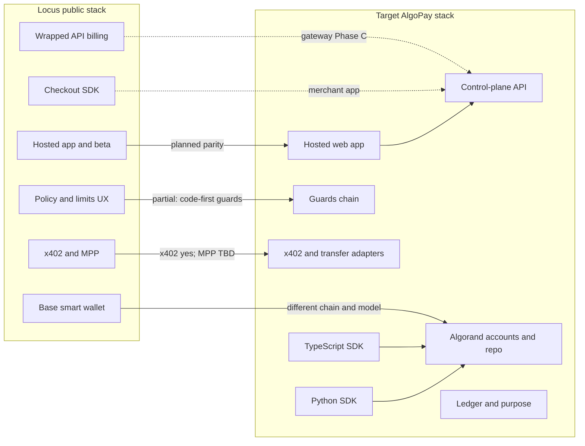

## Execution status (scaffold)

**Blocked in plan mode:** scaffolding the TypeScript SDK, `apps/web`, and non-doc files requires **Agent mode** (or disabling plan-only restriction). When you accept **Agent mode** or start a new agent chat without plan mode, the implementer should:

1. Add npm workspaces root `package.json` with `packages/algopay` (`@algodev-studio/algopay`) and `apps/web` (`algopay-web`).
2. **Custody (Option 2 — Locus-like):** server-side vault encrypting each wallet mnemonic with **AES-256-GCM** and a **master secret** from env (`ALGOPAY_VAULT_MASTER_KEY`, 32-byte base64); document rotation path to **KMS/HSM** (no keys in logs; decrypt only in memory for signing).
3. **apps/web:** Next.js App Router, Prisma + SQLite (dev), models `User`, `Workspace`, `WalletSet`, `Wallet` (encrypted blob), `ApiKey` (hashed), `LedgerEntry`; routes for auth, wallets, API keys, **`POST /api/agent/pay`** (Bearer `sk_…`, builds USDC `axfer` via `algosdk`).
4. **packages/algopay:** `Config`, `AlgoPay` class mirroring Python (`createWalletSet`, `createWallet`, `getBalance`, `pay` with transfer + x402 stub), `algosdk` + vitest.

---

# AlgoPay vs Locus: alignment and Algorand parity path

## What Locus actually is (from public positioning)

Aggregating [Locus on YC](https://www.ycombinator.com/companies/locus), [Launch YC](https://www.ycombinator.com/launches/Oj6-locus-payment-infrastructure-for-ai-agents), [paywithlocus.com](https://paywithlocus.com/), and [docs.paywithlocus.com](https://docs.paywithlocus.com/):

| Pillar | Locus (public) |
|--------|----------------|
| **Money rail** | USDC; emphasizes non-custodial smart wallets on **Base**, sponsored gas, subwallets |
| **Control layer** | Spending rules, limits, allowlists, **justification**, auditability |
| **Agent access** | **Wrapped / pay-per-use APIs** (large provider catalog), “single wallet” for many vendors |
| **Commerce** | **Checkout** (Stripe-like) routing funds into buyer wallets |
| **Platform** | Hosted **app / beta**, dashboard-style workflows, docs (Mintlify), MPP and **x402** in docs |
| **Extra** | “Build with Locus” (deployments), tasks, cards—beyond core pay+control |

So “Locus-like” is not only a client library; it is **product + protocol + marketplace + docs**.

## Algorand resources to lean on

Official positioning and tooling (summarized from [x402 for developers on Algorand](https://algorand.co/agentic-commerce/x402/developers) and [AlgoKit](https://algorand.co/algokit)):

- **x402 roles** — Same mental model as Locus’s HTTP-native flows: **merchant** (pricing/terms), **resource server** (402 gate), **facilitator** (verify settlement, replay/double-spend). AlgoPay SDK stays on the **client/agent** side; production “Locus parity” needs at least one **resource server + facilitator** path (managed or self-hosted).
- **Why Algorand fits x402** — Finality, low fees, USDC ASA, atomic groups — aligns with pay-per-call and agent traffic described on that page.
- **Concrete stack** — Algorand’s guide points to **multichain facilitator**, **OpenAPI docs**, **scheme_exact_algo** (AVM), and **TS/Python server + client packages** (Express, Hono, Next, FastAPI, Flask, httpx, Requests, Core + AVM, Bazaar extension). This is the shortest path to **checkout-like** and **wrapped-API-like** endpoints that settle on Algorand.
- **AlgoKit** — Templates, localnet, deploy, **Algorand TypeScript / Algorand Python (Puya)** for contracts, LORA, debugging. Use when we need **on-chain** analogs to Locus **subwallet escrows**, **payment router**, or **immutable policy hooks**; skip if **off-chain guards + standard accounts** are enough for MVP.

## What AlgoPay is today (this repo)

From [README.md](README.md), [docs/index.md](docs/index.md), and implementation under [src/algopay/](src/algopay/):

| Pillar | AlgoPay today |
|--------|----------------|
| **Money rail** | **Algorand** USDC (**ASA**), standard accounts via [wallet/service.py](src/algopay/wallet/service.py); opt-in, transfers, indexer-backed balances |
| **Control layer** | **Guards**: budget, per-tx min/max, recipient allow/deny (incl. x402 URL domains), rate limits, human confirm — see [docs/guides/guards.md](docs/guides/guards.md) |
| **Protocols** | Direct **ASA transfer** + **x402** ([docs/guides/x402.md](docs/guides/x402.md), [src/algopay/protocols/x402.py](src/algopay/protocols/x402.py)); [payment/router.py](src/algopay/payment/router.py) |
| **Audit / intent** | **Ledger** with `purpose` + `metadata` ([src/algopay/ledger/ledger.py](src/algopay/ledger/ledger.py)); **intents** and batch pay |
| **Storage** | Memory or **Redis** for guard/ledger state (not wallet keys by default) |
| **Explicit non-goals in-repo (today)** | Resource server, facilitator, dashboard live **outside** this Python package — see [docs/REFERENCE_LEGACY_OMNIAGENTPAY_AND_ARC_MERCHANT.md](docs/REFERENCE_LEGACY_OMNIAGENTPAY_AND_ARC_MERCHANT.md) |

**Plan update:** **Hosted dashboard**, **TypeScript SDK**, and **control-plane API** are **new deliverables** (Phase A2 + TS track), not required to live inside `src/algopay` — likely **monorepo** or adjacent repos.

**Verdict on “how close”:** Strong overlap on **governed agent spend** in Python. **Hosted product surface** moves from “gap” to “planned.” Remaining gaps: **EVM 4337 smart wallets**, **wrapped catalog** until Phase C gateway ships, **checkout** until Phase B, **MPP/Base** specifics.

## Making it “exactly like Locus” for Algorand (realistic interpretation)

You cannot duplicate Base ERC-4337 + Base USDC **literally**; parity means **same developer and business outcomes** on Algorand:

1. **One balance / one agent identity** — fund once, spend under rules (wallet sets + guards; productize with hosted API keys / agent registration like [Locus Quick Start (Beta)](https://docs.paywithlocus.com/quickstart-beta.md)).
2. **Enforced policies** — budgets, per-pay caps, allowlists, optional human approval; add **mandatory justification** and **approval thresholds** (Locus wraps high-cost wrapped calls with `202` + `approval_url` — mirror with confirm guard + async intent).
3. **Pay for HTTP APIs** — Primary Algorand path: **x402** everywhere we can ([developer guide](https://algorand.co/agentic-commerce/x402/developers)). **Wrapped APIs** in Locus are a **hosted proxy + catalog + treasury sweep on Base** ([Wrapped APIs](https://docs.paywithlocus.com/wrapped-apis/index.md)); we replicate the **pattern** (proxy, reserve-before-upstream, refund on failure, per-provider rate-limit shield), not their provider contracts.
4. **MPP / multi-chain** — Locus [MPP](https://docs.paywithlocus.com/wrapped-apis/mpp.md) is **402 on Tempo** with USDC.e; [x402 for Build](https://docs.paywithlocus.com/build/x402.md) uses **Polygon/Base + facilitator**. Optional for us: **expose our catalog via x402 on Algorand only** first; integrate other facilitators/chains only if product requires it.
5. **Checkout** — Locus: sessions, React SDK, hosted page, webhooks, Locus wallet vs external wallet vs agent ([Checkout](https://docs.paywithlocus.com/checkout/index.md)). We implement **session + settle on-chain + webhook** using Algorand USDC + optional **payment router**-style contract (AlgoKit) if we need composable routing.
6. **Wallets** — Locus: **dual-signer 4337 account**, HSM permissioned key, **gasless paymaster**, **subwallet pool** for email/escrow ([Wallets](https://docs.paywithlocus.com/features/wallets.md)). Algorand: **standard accounts + optional smart accounts**; **fee payer** or **rekey** for “agent doesn’t hold ALGO”; escrow via **app** or **separate accounts** per subwallet.
7. **Build / deploy / billing** — [Build with Locus](https://docs.paywithlocus.com/build/index.md) + [x402 sign-up/top-up](https://docs.paywithlocus.com/build/x402.md) is a **separate product vertical**; parity is optional unless we scope “agent deploys infra and pays from same balance.”
8. **Tasks, Laso, credits, hackathon** — Business/features ([Tasks](https://docs.paywithlocus.com/features/tasks.md), [Laso](https://docs.paywithlocus.com/features/laso.md), [credits](https://docs.paywithlocus.com/credits.md)): **not protocol**; defer or partner.

## Locus docs → Algorand / AlgoPay mapping

| Locus docs area | What it is | Feasible on Algorand / our stack | Notes |
| --- | --- | --- | --- |
| [Welcome / Quick Start](https://docs.paywithlocus.com/index.md) | Onboarding, one USDC balance | **Yes** (product) | Hosted app + docs mirroring Mintlify structure |
| [Wallets](https://docs.paywithlocus.com/features/wallets.md) | 4337, permissioned key, paymaster, subwallets | **Partial** | No 4337; use Algorand accounts + **fee payer**, **rekey**, **AlgoKit escrow app** for subwallet-like escrows |
| [USDC / email sends](https://docs.paywithlocus.com/features/send-types.md) | Transfers, email-linked flows | **Partial** | ASA transfers yes; **email + OTP claim** is off-chain product |
| [Wrapped APIs](https://docs.paywithlocus.com/wrapped-apis/index.md) | Proxy, catalog, per-call billing, provider toggles | **Yes** (service) | New **gateway**; AlgoPay guards = client-side; server enforces allowance like Locus “reserve” |
| [MPP](https://docs.paywithlocus.com/wrapped-apis/mpp.md) | 402 on Tempo | **Optional** | Our default: **x402 + Algorand settlement**; MPP is different chain |
| [Agent integration / catalog](https://docs.paywithlocus.com/wrapped-apis/for-agents.md), [providers](https://docs.paywithlocus.com/wrapped-apis/providers.md) | Discovery (`/api/wrapped/md`, discover `.md`) | **Yes** | Ship **OpenAPI + machine-readable endpoint lists** like Locus discover URLs |
| [Checkout](https://docs.paywithlocus.com/checkout/index.md) | Sessions, React SDK, webhooks | **Yes** (app + SDK) | `@withlocus/checkout-react` analog; settle USDC on Algorand |
| [Payment router](https://docs.paywithlocus.com/checkout/payment-router.md) | On-chain router for external wallets | **Partial** | Algorand **router app** or simple merchant receive + facilitator verify |
| [Build / x402 / MPP](https://docs.paywithlocus.com/build/x402.md) | Workspace JWT via x402 (Polygon/Base) or MPP (Tempo) | **Optional** | Different chains; we could offer **Algorand x402** for our own “workspace credits” |
| [Build services](https://docs.paywithlocus.com/build/services.md) | Deploy via API/git | **Out of scope** unless we expand | Separate from payments SDK |
| [Beta / agent self-registration](https://docs.paywithlocus.com/beta.md) | Isolated env, agent signs up | **Yes** (product) | Env separation + registration API |
| [Tasks](https://docs.paywithlocus.com/features/tasks.md), [Laso](https://docs.paywithlocus.com/features/laso.md) | Human tasks, virtual cards | **No / partner** | Not core SDK |

## Phased roadmap (recommended)

### Phase A — Dual SDKs + policy depth (Python + TypeScript)

**Python ([algopay-sdk](README.md))**

- Harden **policy**: optional **mandatory justification** guard; richer **metadata** for agent/tool correlation; **approval thresholds** aligned with Locus wrapped-API behavior where applicable.
- **Subwallet / segregation**, **fee payer** patterns — same as prior plan.

**TypeScript (new package; monorepo `packages/algopay` or sibling repo—decide at implementation time)**

- **API surface parity** with Python `AlgoPay`: config/network, `WalletService` patterns, `pay()`, guard registration, ledger read/write hooks, intents/batch if present in Python.
- **Implementation**: `algosdk` + types; x402 client aligned with [@x402-avm](https://algorand.co/agentic-commerce/x402/developers) fetch patterns where appropriate; vitest + golden tests **shared scenarios** with Python (same addresses/mocks) to prevent drift.
- **Publishing**: npm scope (e.g. `@algodev/algopay`), ESM, `exports` map, CI release workflow mirroring PyPI.
- **Docs**: TypeDoc or hand-written parity table Python ↔ TS on the docs site.

### Phase A2 — Hosted frontend + control-plane API (Locus-like product)

**Goal:** A deployable **web app** analogous to [Locus app](https://app.paywithlocus.com/) + [platform walkthrough](https://docs.paywithlocus.com/platform-walkthrough.md): humans configure agents, not only code.

**Suggested stack:** **Next.js** (App Router) + auth (e.g. Clerk, Auth.js, or Supabase) + **control-plane REST/GraphQL** backed by Postgres (tenants, users, API keys) and **Redis** for guard counters if server enforces policy; optional **Vercel** or self-hosted.

**MVP screens (map to Locus mental model)**

- **Onboarding / org** — workspace, beta vs prod toggle ([Locus beta isolation](https://docs.paywithlocus.com/beta.md)).
- **Wallets** — list wallet sets and addresses, USDC balance, opt-in status, copy funding address, testnet faucet links.
- **Policies** — budgets, per-tx limits, recipient allowlists, rate limits, confirmation thresholds (mirror [guards](docs/guides/guards.md) in UI).
- **API keys** — create/revoke agent keys bound to a wallet set (server validates key → loads policy + signing context).
- **Activity** — ledger-style history (`purpose`, amount, recipient, tx id, blocked vs completed).
- **Later:** provider toggles for wrapped gateway, checkout session list (when Phase B/C exist).

**Signing architecture (critical design choice)**

- **Option 1 — Client-held keys:** Dashboard exports mnemonic / shows backup once; agent runs TS/Python SDK with keys (true non-custodial; weakest Locus-like “permissioned key” story).
- **Option 2 — Server-assisted signing:** HSM/KMS-backed signing or encrypted key material with user password (closer to Locus **permissioned key**; much higher security/compliance burden).
- **Option 3 — Hybrid:** User-owned key for recovery; **limited** server key for automated agent spend within policy (document threat model explicitly).

Record the chosen option in ADR before building auth flows.

### Phase B — Ecosystem layer (merchant + facilitator + checkout)

- Implement the **x402 server + facilitator** split as in [Algorand’s x402 developer guide](https://algorand.co/agentic-commerce/x402/developers): choose **managed facilitator** for speed or **self-hosted** for custom policy; verify/settle per [scheme_exact_algo](https://github.com/coinbase/x402/blob/main/specs/schemes/exact/scheme_exact_algo.md).
- Reuse ecosystem packages where appropriate (Express/Hono/Next/FastAPI patterns from that page) alongside **AlgoPay Python or TypeScript** as the agent client.
- **Checkout**: session model + webhooks per [Locus checkout lifecycle](https://docs.paywithlocus.com/checkout/index.md); **checkout React SDK** can live as `packages/checkout-react` next to the TS SDK or inside the hosted app initially.

### Phase C — “Wrapped APIs” and network effects

- **Gateway**: Mirror Locus [Wrapped APIs](https://docs.paywithlocus.com/wrapped-apis/index.md) — catalog API, `POST /wrapped/<provider>/<endpoint>`, **reserve → call upstream → charge or release**, human approval for high-value calls, **dashboard toggles** for providers/endpoints.
- **Discovery**: Publish per-provider machine-readable specs (Locus uses `paywithlocus.com/discover/...md`; we can use md or OpenAPI fragments).
- **MPP**: Treat as **optional** cross-chain access to *their* catalog; primary story should be **Algorand-settled x402** for *our* catalog and for third-party APIs that adopt x402.
- **Docs and beta**: Align with [AlgoKit](https://algorand.co/algokit)-style DX (templates, skills) for agent builders; beta isolation like [Locus beta](https://docs.paywithlocus.com/beta.md).

## Key takeaway

- **Already close (Python SDK):** Governed **USDC (ASA)** spend, **x402 client**, **guards**, **ledger** with purpose/metadata — the same **control-layer narrative** as Locus for agent-side policy.
- **Now in scope:** **TypeScript SDK** (parity + npm) and a **hosted dashboard** (Locus-style) backed by a **control-plane API**, with an explicit **signing/custody ADR** before production promises.
- **Reachable with Algorand stack:** Full **x402 pay-per-use** surface ([developer guide](https://algorand.co/agentic-commerce/x402/developers)); **checkout** and **wrapped API gateway** as **companion services**; **on-chain extras** (router, escrow) via [AlgoKit](https://algorand.co/algokit) when justified.
- **Inherently different or heavy lift:** ERC-4337 **dual-signer + HSM permissioned key** model ([Locus wallets](https://docs.paywithlocus.com/features/wallets.md)); **Tempo MPP** and **Polygon/Base x402** for *their* Build product ([x402 doc](https://docs.paywithlocus.com/build/x402.md)); **Tasks / Laso** — partner or defer.
- **Maximum Locus-like product:** Run **Phase A + A2** (dual SDKs + web app) in parallel with **Phase B + C** (facilitator x402, checkout, wrapped gateway), using official **Algorand x402** tooling for verification and **AlgoKit** only where on-chain logic is required.
