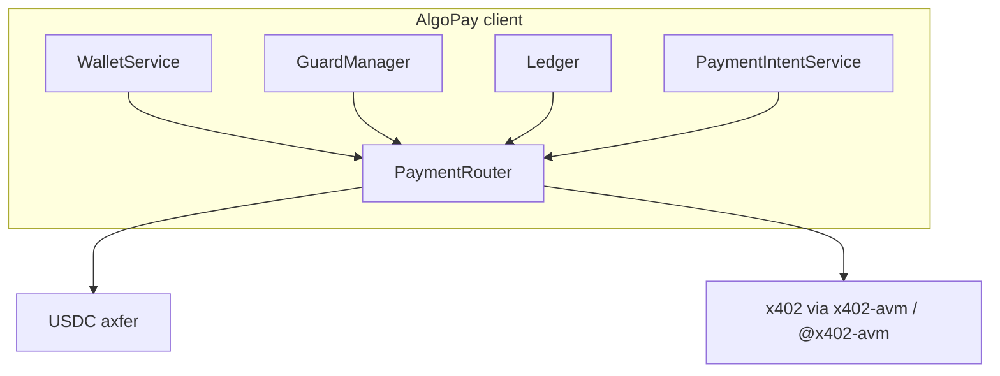

# AlgoPay SDK

**Payment infrastructure for AI agents on [Algorand](https://www.algorand.com/)** — local wallets, **USDC (ASA)** transfers, **[x402](https://github.com/coinbase/x402)** HTTP 402 pay-per-call, spending **guards**, **ledger**, **payment intents**, and **batch** execution.

This repository ships **two client libraries** plus an optional hosted dashboard:

| Package | Registry | Install |
| ------- | -------- | ------- |
| **Python** | [PyPI `algopay-sdk`](https://pypi.org/project/algopay-sdk/) | `pip install "algopay-sdk==0.1.0a3"` |
| **TypeScript** | [npm `@algodev-studio/algopay`](https://www.npmjs.com/package/@algodev-studio/algopay) | `npm install @algodev-studio/algopay@0.1.0-alpha.2` |

> **Status: 0.1.0 alpha** — APIs and behavior may change. See [Testing roadmap](docs/TESTING_ROADMAP.md) before production use.  
> **Source:** [github.com/Algodev-Studio/algopay-sdk](https://github.com/Algodev-Studio/algopay-sdk) · **Docs site:** [algodev-studio.github.io/algopay-sdk](https://algodev-studio.github.io/algopay-sdk/)

---

## Features at a glance

| Capability | Python | TypeScript |
| ---------- | :----: | :--------: |
| Wallet sets / create / list / USDC balance | Yes | Yes |
| `pay()` → Algorand address (USDC transfer) | Yes | Yes |
| `pay()` → `https://` URL (x402) | Yes | Yes |
| Guards (budget, single-tx, recipient, rate-limit, confirm, justification) | Yes | Yes |
| Guard-integrated `pay()` + ledger recording | Yes | Yes |
| `simulate` / `can_pay` / `detect_method` | Yes | Yes (`canPay` / `detectMethod`) |
| Payment intents (authorize → confirm) | Yes | Yes |
| `batch_pay` / `batchPay` | Yes | Yes |
| `sync_transaction` / `syncTransaction` (Indexer lookup) | Yes | Yes |
| `list_transactions` / `listTransactions` | Yes | Yes |
| Storage `memory` | Yes | Yes |
| Storage `redis` | Yes | No (use `registerStorageBackend()` for custom) |
| Error hierarchy + logging | Yes | Yes |

Full product matrix (console vs SDK): [docs/PLATFORM_FEATURE_MATRIX.md](docs/PLATFORM_FEATURE_MATRIX.md).  
TypeScript API naming and method map: [docs/guides/typescript.md](docs/guides/typescript.md).

---

## Architecture



1. **`pay()`** builds a **payment context**, runs the **guard chain** (unless `skip_guards` / `skipGuards`), writes a **ledger** entry, then routes the recipient:
   - **58-character Algorand address** → USDC asset transfer (Algod).
   - **`http://` or `https://` URL** → x402 discovery and payment (`x402-avm` in Python, `@x402-avm/*` in TypeScript).
2. **Guards** can be scoped per **wallet** or **wallet set** (budgets, allowlists, rate limits, human confirmation, justification text).
3. **Payment intents** separate **simulate / authorize** from **capture** (`confirm_payment_intent` / `confirmPaymentIntent`).
4. **Storage** persists guard state, ledger rows, and intents (`memory` by default; Python also supports **Redis** via `ALGOPAY_STORAGE_BACKEND=redis`).

Wallet **keys** live in an in-process `WalletRepository` unless you plug in your own persistence.

---

## Install

### Python

PyPI distribution name is **`algopay-sdk`**; import **`algopay`** in code.

```bash
pip install "algopay-sdk==0.1.0a3"
# or pre-releases in range (avoid 0.1.0a2 — broken PyPI wheel):
pip install --pre "algopay-sdk>=0.1.0a3,<0.2"
```

**From a clone (development):**

```bash
pip install -e "./python[dev]"
```

Requires **Python 3.10+**.

### TypeScript

```bash
npm install @algodev-studio/algopay@0.1.0-alpha.2
```

**From this monorepo:**

```bash
npm install
npm run build --workspace=@algodev-studio/algopay
```

Requires **Node 20+**.

---

## Quick start (Python)

```python
import asyncio
from algopay import AlgoPay
from algopay.core.types import Network

async def main():
    client = AlgoPay(network=Network.ALGORAND_TESTNET)
    ws = client.wallet.create_wallet_set("my-agent")
    w = client.wallet.create_wallet(ws.id)

    await client.add_budget_guard(w.id, daily_limit="100")
    # Fund ALGO, opt_in_usdc, acquire USDC — then:
    result = await client.pay(
        w.id,
        "RECEIVER58CHARALGORANDADDRESSAAAAAAAAAAAA",
        "0.01",
        purpose="demo",
    )
    print(result.success, result.blockchain_tx)

asyncio.run(main())
```

Examples: [`python/examples/basic_payment.py`](python/examples/basic_payment.py), [`python/examples/x402_client_demo.py`](python/examples/x402_client_demo.py).

---

## Quick start (TypeScript)

```typescript
import { AlgoPay, Network } from "@algodev-studio/algopay";

const client = new AlgoPay({ network: Network.ALGORAND_TESTNET });
const set = await client.createWalletSet("my-agent");
const w = await client.createWallet(set.id);

await client.addBudgetGuard(w.id, { dailyLimit: "100" });
const result = await client.pay(w.id, "RECEIVER58CHAR...", "0.01", {
  purpose: "demo",
});
console.log(result.success, result.blockchainTx);
```

**x402 (pay a URL):**

```typescript
const result = await client.pay(
  w.id,
  "https://api.example.com/paid-resource",
  "1.0", // max USDC cap
);
```

---

## Environment variables

Both SDKs read the same core variables (see **[docs/ENVIRONMENT.md](docs/ENVIRONMENT.md)**):

| Variable | Purpose |
| -------- | ------- |
| `ALGOPAY_NETWORK` | `algorand-testnet` (default) or `algorand-mainnet` |
| `ALGOD_URL` / `ALGOPAY_ALGOD_URL` | Algod REST API |
| `INDEXER_URL` / `ALGOPAY_INDEXER_URL` | Indexer REST API |
| `ALGOPAY_USDC_ASA_ID` | USDC ASA ID override |
| `ALGOPAY_STORAGE_BACKEND` | `memory` (default) or `redis` (**Python only** built-in) |
| `ALGOPAY_REDIS_URL` | Redis URL when using `redis` backend |
| `ALGOPAY_LOG_LEVEL` | `DEBUG`, `INFO`, … |

Example-only (scripts): `ALGOPAY_TO_ADDRESS`, `ALGOPAY_AMOUNT`, `ALGOPAY_X402_URL`, `ALGOPAY_MAX_USDC`.

---

## Implementation details

### Recipient routing

`PaymentRouter` (TypeScript) or registered adapters (Python `TransferAdapter` + `X402Adapter`) choose the path from the **recipient string** — no separate “mode” flag.

### Guards

Six guard types, attachable to a wallet or wallet set:

| Guard | Role |
| ----- | ---- |
| **Budget** | Daily / hourly / total USDC caps |
| **SingleTx** | Min/max per transaction |
| **Recipient** | Allowlist / blocklist (addresses, patterns, domains for URLs) |
| **RateLimit** | Transactions per minute / hour / day |
| **Confirm** | Human confirmation over a threshold |
| **Justification** | Require non-empty `purpose` |

Python: `await client.add_budget_guard(...)`. TypeScript: `await client.addBudgetGuard(...)`. Guide: [docs/guides/guards.md](docs/guides/guards.md).

### Ledger and intents

- Every `pay()` records a **ledger entry** (status transitions: pending → completed / failed / blocked).
- **`sync_transaction` / `syncTransaction`** confirms an entry against the **Indexer**.
- **Intents**: `create_payment_intent` → `confirm_payment_intent` (or cancel). Guide: [docs/guides/intents-batch.md](docs/guides/intents-batch.md).

### Batch

`batch_pay` / `batchPay` runs many `PaymentRequest` items with a concurrency limit (default 5).

### x402 stack

- Python: [`x402-avm`](https://pypi.org/project/x402-avm/) with Algorand **exact** scheme ([spec](https://github.com/coinbase/x402/blob/main/specs/schemes/exact/scheme_exact_algo.md)).
- TypeScript: `@x402-avm/fetch`, `@x402-avm/avm`, `@x402-avm/core`.

---

## Monorepo layout

| Directory | Contents |
| --------- | -------- |
| [`python/`](python/) | PyPI **`algopay-sdk`** · `src/algopay/` · tests · examples |
| [`typescript/`](typescript/) | npm **`@algodev-studio/algopay`** |
| [`pay/`](pay/) | Next.js dashboard (**`algopay-console`**) — vault, API keys, `POST /api/agent/pay` |
| [`docs/`](docs/) | MkDocs user guide + API reference (Python) |

See [REPOSITORY_LAYOUT.md](REPOSITORY_LAYOUT.md) and [docs/DOCUMENTATION_MAP.md](docs/DOCUMENTATION_MAP.md).

### Hosted control plane (optional)

The **`pay/`** app is a **server-assisted signing** dashboard (encrypted vault, workspace policies). It is **not** required to use the SDKs in your own process.

```bash
npm install
cp pay/.env.example pay/.env
# SESSION_SECRET (32+ chars), ALGOPAY_VAULT_MASTER_KEY (base64 32 bytes), DATABASE_URL
npm run db:push --workspace=algopay-console
npm run dev
```

Details: [docs/ecosystem/CONTROL_PLANE.md](docs/ecosystem/CONTROL_PLANE.md).

---

## Documentation

| Resource | Link |
| -------- | ---- |
| Documentation map | [docs/DOCUMENTATION_MAP.md](docs/DOCUMENTATION_MAP.md) |
| Getting started (Python) | [docs/getting-started.md](docs/getting-started.md) |
| TypeScript SDK guide | [docs/guides/typescript.md](docs/guides/typescript.md) |
| Publishing | [docs/PUBLISHING.md](docs/PUBLISHING.md) |
| Changelog | [CHANGELOG.md](CHANGELOG.md) |
| AI agent orientation | [AGENTS.md](AGENTS.md) |

**Build docs locally:**

```bash
pip install -e "./python[docs]"
mkdocs serve
```

---

## Development

```bash
# Python
cd python && pytest -m "not integration"

# TypeScript
npm run build --workspace=@algodev-studio/algopay
npm run test:js
```

---

## License

MIT — see [LICENSE](LICENSE).
