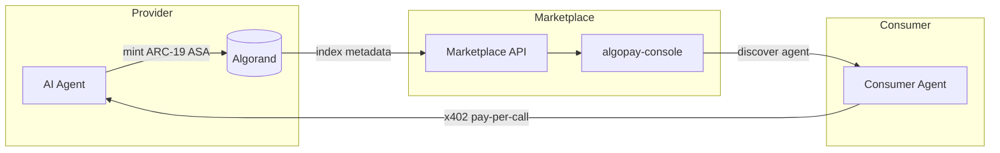
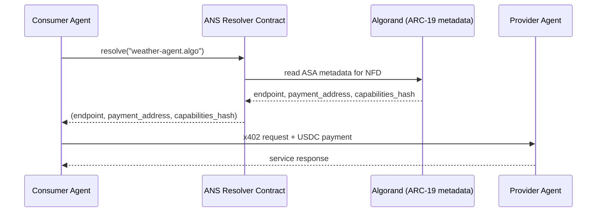
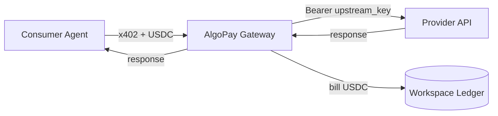
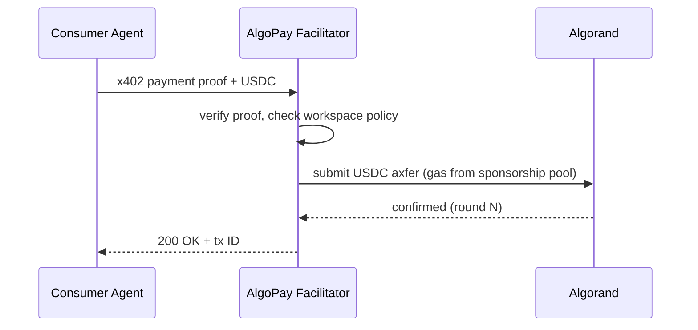

# Future scope — AlgoPay

> **Living document.** This page captures planned and exploratory directions for AlgoPay. Items range from near-term engineering work to longer-horizon research. Status labels reflect current confidence; treat anything without shipped code as subject to change.

**Navigation:** [Documentation map](DOCUMENTATION_MAP.md) · [Platform feature matrix](PLATFORM_FEATURE_MATRIX.md) · [Monetization](ecosystem/MONETIZATION.md) · [Control plane](ecosystem/CONTROL_PLANE.md)

---

## 1. Agent Marketplace (Algorand-native)

AlgoPay already governs how agents **spend**. The next step is governing how agents are **discovered, registered, and monetized** — an on-chain marketplace where AI agents publish capabilities and consumers pay per call or subscribe through the AlgoPay SDK.

### Why Algorand

Algorand's sub-second finality, low fees, and native ASA infrastructure make it well-suited for high-frequency micro-transactions between agents. Platforms like [CoralOS](https://www.coralos.ai/) have demonstrated agent marketplace demand on Solana; AlgoPay brings this model to Algorand with tighter integration into the x402 payment layer.

### Design

- **On-chain registration.** Agents publish capability metadata as ARC-compatible assets (ARC-3 for structured JSON, ARC-19 for immutable IPFS-pinned descriptors, ARC-69 for lightweight note-field metadata). Each registration is an ASA minted to the agent's wallet.
- **Billing models.** Pay-per-call via x402 (`402 Payment Required` → USDC settlement) and subscription billing via recurring AlgoPay intents, both enforced by SDK guards.
- **Trust and reputation.** On-chain payment history feeds a trust score: transaction volume, dispute rate, uptime, and peer ratings stored as ARC-69 note-field updates. Consumers filter agents by minimum trust threshold before routing spend.
- **Dashboard integration.** The marketplace ships inside `algopay-console` (`pay/`) as a new top-level route — no separate app. Operators browse, subscribe, and manage agent access from the same dashboard they use for policies and wallets.
- **Marketplace API.** A public REST endpoint (`GET /api/marketplace/agents`) returns paginated, filterable agent listings with metadata, pricing, and trust scores.



### CoralOS comparison

| Dimension | CoralOS (Solana) | AlgoPay Marketplace (Algorand) |
| --------- | ---------------- | ------------------------------ |
| Chain | Solana | Algorand |
| Payment protocol | Custom RPC | x402 + USDC ASA |
| Agent metadata | Program accounts | ARC-3 / ARC-19 / ARC-69 ASAs |
| Billing | Token staking | Pay-per-call + subscription via AlgoPay SDK |
| Governance | Token-weighted | On-chain trust score + policy guards |
| Dashboard | Standalone | Integrated into existing `algopay-console` |

---

## 2. Agent Name Service (ANS)

Human-readable identifiers for agents — `weather-agent.algo`, `research-bot.algo` — built on [Algorand Name Service / NFD](https://app.nf.domains/) infrastructure.

> **Status:** Experimental. We are currently prototyping ANS resolution against NFD's ASA-based domain system.

### ANS record structure

Each ANS name maps to an ASA whose ARC-19 metadata contains a JSON record:

```json
{
  "name": "weather-agent.algo",
  "endpoint": "https://weather.example.com/v1",
  "payment_address": "ALGO...",
  "capabilities": ["forecast", "alerts", "historical"],
  "policy": { "maxSingleTxUsdc": 1.00, "requireJustification": true },
  "pricing": { "per_call_usdc": 0.005, "subscription_monthly_usdc": 9.99 }
}
```

### Resolution flow



### Technical approach

- **Storage.** ARC-19 metadata on ASA-based NFDs. The metadata URL points to an IPFS-pinned JSON document; the on-chain reserve address encodes the IPFS CID.
- **Resolver contract.** A stateful smart contract exposing an ABI method `resolve(string)(string,string,string)` that returns `(endpoint, payment_address, capabilities_hash)`. The contract reads the ASA's reserve address, fetches the ARC-19 template, and returns parsed fields.
- **x402 integration.** ANS names can serve as x402 resource identifiers: a consumer agent calls `pay("weather-agent.algo", amount)`, the SDK resolves the name to an endpoint and payment address, then initiates the x402 handshake.

---

## 3. Wrapped API Gateway

Proxy any REST API behind an x402 paywall. The gateway handles upstream authentication, per-call USDC metering, and billing — so API providers need only register their endpoint and AlgoPay handles the rest.

### Architecture

- **Upstream secret management.** Provider API keys stored in the vault (same encryption layer as wallet mnemonics; see [Control plane](ecosystem/CONTROL_PLANE.md)).
- **Per-call billing.** Each proxied request deducts USDC from the consumer's workspace balance. Pricing set per endpoint in the catalog.
- **Dashboard catalog.** Already partially scaffolded under `pay/src/app/dashboard/apis/`. The gateway extends this with provider registration, endpoint toggles, and usage analytics.
- **Settlement.** Upstream cost + 5–15% markup (see [Monetization](ecosystem/MONETIZATION.md) for tier details).



### Phases

1. **Algorand-first** — Expose catalog via x402 with Algorand USDC settlement (see [Wrapped APIs strategy](ecosystem/wrapped-apis.md)).
2. **Proxy gateway** — `POST /gateway/:provider/:endpoint` with workspace Bearer key; server enforces allowance, calls upstream, bills treasury.
3. **External catalogs** — Optional bridge to third-party x402/MPP endpoints.

---

## 4. Enterprise Features

Capabilities required for regulated environments and large-team deployments.

| Feature | Description | Status |
| ------- | ----------- | ------ |
| **SSO / SAML** | Federated identity via SAML 2.0 or OIDC; map IdP groups to AlgoPay workspaces | Planned |
| **KMS / HSM envelope encryption** | Replace static `ALGOPAY_VAULT_MASTER_KEY` with cloud KMS (AWS KMS, GCP Cloud KMS, Azure Key Vault) envelope encryption; HSM-backed key unwrap for vault mnemonics | Planned |
| **Compliance audit exports** | SOC 2–compatible CSV/JSON exports of all agent transactions, policy changes, and approval decisions with tamper-evident hashing | Planned |
| **Multi-workspace RBAC** | Hierarchical roles (Owner → Admin → Operator → Viewer) with approval chains: high-value transactions require n-of-m operator approval before signing | Planned |
| **Sanctions screening** | Pre-transaction address screening against OFAC SDN and EU sanctions lists via integration with Chainalysis or Elliptic; block or flag before USDC settlement | Planned |

Enterprise features will be available on the **Enterprise** tier of the hosted control plane (see [Monetization](ecosystem/MONETIZATION.md)).

---

## 5. Cross-chain Settlement

AlgoPay's default settlement chain is Algorand. Cross-chain settlement extends reach to agents and services operating on EVM chains.

### Approach

- **Wormhole bridge.** USDC on Algorand ↔ wrapped USDC on Ethereum, Base, Polygon via Wormhole's token bridge. The SDK abstracts bridge mechanics behind `pay()` — the caller specifies a destination chain, and the SDK routes through Wormhole relayers.
- **Circle CCTP.** When Circle's Cross-Chain Transfer Protocol supports Algorand (currently EVM + Solana), native USDC burns on the source chain and mints on the destination — no wrapped tokens, no bridge risk.
- **Multi-chain agent wallets.** A single dashboard workspace manages Algorand + EVM wallets. The vault encrypts keys for each chain independently; policies apply cross-chain (e.g., a $100/day budget spans all chains).

### Settlement matrix

| Source | Destination | Mechanism | Status |
| ------ | ----------- | --------- | ------ |
| Algorand USDC | Algorand USDC | Direct axfer | Shipped |
| Algorand USDC | Ethereum/Base/Polygon USDC | Wormhole token bridge | Planned |
| Algorand USDC | Solana USDC | Wormhole token bridge | Planned |
| Any chain USDC | Algorand USDC | Circle CCTP (when available) | Research |

---

## 6. Redis Shared Guards

Guard state (budgets, rate limits, counters) shared across SDK instances using Redis, so the same spending policy is enforced whether an agent runs locally via the Python SDK or through the hosted dashboard.

### Current state

The Python SDK already supports `ALGOPAY_STORAGE_BACKEND=redis` for persisting guard counters in Redis (see [ENVIRONMENT.md](ENVIRONMENT.md)). The TypeScript SDK supports custom storage backends via `registerStorageBackend`.

### Planned work

- **Dashboard ↔ SDK convergence.** The console (`pay/`) and Python SDK share the same Redis keyspace. A `BudgetGuard` counter incremented by the SDK is visible to the dashboard policy engine, and vice versa.
- **Atomic operations.** Guard checks use Redis `MULTI`/`EXEC` or Lua scripts to prevent race conditions when multiple agent instances hit the same budget window.
- **TTL-based windows.** Budget periods (daily, weekly, monthly) implemented as Redis keys with TTL expiry — no cron jobs, no manual resets.
- **TypeScript parity.** Ship a first-party `redis` storage backend in `@algodev-studio/algopay` (currently the user must supply a custom adapter).

---

## 7. Facilitator Network

AlgoPay-operated x402 facilitator nodes on Algorand mainnet that handle settlement on behalf of agents, removing the need for each agent to manage gas and transaction submission.

### Components

- **Facilitator nodes.** Stateless services that receive signed x402 payment proofs, verify them, and submit Algorand transactions. Operated by AlgoPay with high-availability SLA.
- **Gas sponsorship pools.** Pre-funded ALGO pools that cover transaction fees for agent-to-agent payments. Agents pay in USDC; the facilitator covers ALGO gas from the pool.
- **Revenue model.** 1,000 transactions free per month per workspace. Beyond that: **$0.001/tx** settlement fee (see [Monetization](ecosystem/MONETIZATION.md)). Gas sponsorship passes through ALGO cost + ~10% markup.

### Flow



---

## 8. SDK Ecosystem Expansion

Broaden AlgoPay's reach beyond Python and TypeScript.

### New language SDKs

| Language | Priority | Notes |
| -------- | -------- | ----- |
| **Go** | High | Cloud-native agents, Kubernetes operators |
| **Rust** | Medium | Performance-critical agents, WASM targets |
| **Java/Kotlin** | Medium | Android agents, enterprise JVM workloads |

All new SDKs will target feature parity with the current Python/TypeScript surface: wallet management, `pay()`, guards, ledger, intents, and x402 support.

### MCP server

A Model Context Protocol server that exposes AlgoPay operations as MCP tools — enabling any MCP-compatible agent framework to make governed payments without SDK-specific integration code. A community example already exists: `typescript/examples/community/mcp-weather-payer/`.

### Framework adapters

Native tool adapters for popular agent frameworks:

- **LangChain** — `AlgoPayTool` for LangChain's tool interface; agents call `pay()` as a tool action with automatic guard enforcement.
- **CrewAI** — `AlgoPayCrewTool` wrapping the Python SDK; budget-aware agents in multi-agent crews (see community example: `python/examples/community/crew-spend-tracker/`).
- **AutoGen** — Function-calling tool registration for AutoGen agents with built-in spend tracking.

### React hooks library

A `@algodev-studio/algopay-react` package providing hooks for frontend integration:

```typescript
const { balance, pay, transactions } = useAlgoPay({ workspaceId: "..." });
```

Hooks for wallet balance, payment submission, transaction history, and policy status — enabling React apps to interact with AlgoPay without direct SDK wiring.

---

## Timeline and prioritization

| Horizon | Items | Confidence |
| ------- | ----- | ---------- |
| **Near-term** (next 3 months) | Redis shared guards, wrapped API gateway phase 1, MCP server, framework adapters | High |
| **Medium-term** (3–9 months) | Agent Marketplace v1, ANS prototype, facilitator network, Go SDK, enterprise SSO/KMS | Medium |
| **Long-term** (9–18 months) | Cross-chain settlement, full ANS with x402 integration, Rust/Java SDKs, sanctions screening | Exploratory |

---

## How to contribute

Future scope items are tracked as GitHub issues labeled `future-scope`. Community contributions are welcome — especially for new language SDKs, framework adapters, and marketplace agent integrations. See the repository [README](https://github.com/Algodev-Studio/algopay-sdk) for contribution guidelines.
