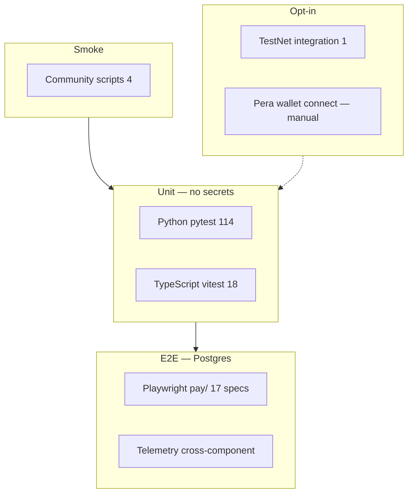

# Testing report

**Last full-matrix run:** 2026-06-11 (local Windows + CI configuration validated)

This document is the **canonical testing report** for the AlgoPay monorepo. For the unit-test backlog toward 1.0, see [TESTING_ROADMAP.md](TESTING_ROADMAP.md).

---

## Executive summary

| Layer | Status | Tests | Coverage / notes |
|-------|--------|-------|------------------|
| Python SDK | Green | 114 passed, 1 deselected | **75%** line coverage |
| TypeScript SDK | Green | 18 passed (7 files) | **44%** statement coverage (key guards, router, telemetry, client) |
| pay/ dashboard (Playwright) | Suite added; runs in CI | 17 specs + 1 `fixme` | Requires Postgres (Docker or CI service) |
| SDK → console telemetry | Green (unit + e2e spec) | 5 Python + 3 TS + 1 Playwright | Contract validated with mocks |
| Community examples | Green | 4/4 smoke scripts | Mock mode (`ALGOPAY_DEMO_MODE=mock`) |
| Docs (MkDocs) | Pre-existing strict warnings | Build smoke | `DEMO.md` broken links fail `--strict` |
| Integration (live TestNet) | Opt-in only | 1 test | Not in default CI |

---

## Test pyramid



---

## Metrics (last run)

### Python SDK

| Metric | Value |
|--------|-------|
| Command | `cd python && pytest --cov=algopay --cov-report=term-missing -m "not integration"` |
| Tests passing | **114** |
| Integration deselected | 1 (`test_testnet_live.py`) |
| Test files | 25 under `python/tests/` |
| Line coverage | **75%** (2212 statements) |
| Duration | ~28s |
| Telemetry module coverage | **95%** (`telemetry/reporter.py`) |

### TypeScript SDK

| Metric | Value |
|--------|-------|
| Command | `npm run test:js` (repo root) |
| Tests passing | **18** |
| Test files | 7 (`config`, `budget`, `rate-limit`, `manager`, `router`, `telemetry`, `client`) |
| Statement coverage | **44%** (`npm run test:coverage --workspace=@algodev-studio/algopay`) |
| Duration | ~8–10s |
| Telemetry module coverage | **100%** |

### pay/ dashboard (Playwright)

| Metric | Value |
|--------|-------|
| Location | `pay/e2e/*.spec.ts` |
| Spec files | 10 |
| Runnable tests | **17** |
| Skipped / fixme | 1 (approvals approve/reject — API routes missing) |
| Local prerequisite | `docker compose -f pay/docker-compose.e2e.yml up -d` then `npm run test:e2e` |
| CI | `.github/workflows/ci.yml` `js` job with Postgres service |

**E2E suites:**

| File | Scenarios |
|------|-----------|
| `auth.spec.ts` | Register, login, invalid creds, unauthenticated redirect |
| `navigation.spec.ts` | Sidebar links, network toggle |
| `merchants.spec.ts` | Create → list |
| `gas.spec.ts` | Create pool → list |
| `agents.spec.ts` | Create agent (requires pool) |
| `api-keys.spec.ts` | Generate key one-time display |
| `sdk-events.spec.ts` | Bearer POST → dashboard row |
| `playground.spec.ts` | List agents / merchants |
| `api.spec.ts` | 401 without session; payment `process` → `SIM_*` txn |
| `approvals.spec.ts` | UI load; approve action `fixme` |

### Community examples

| Script | Status |
|--------|--------|
| `budgetbot/budgetbot.py` | PASS |
| `research-agent-receipts/export_receipts.py` | PASS |
| `crew-spend-tracker/crew_tracker.py` | PASS |
| `slack-approval-gate/approval_gate.py` | PASS |

Command: `npm run smoke:community` or `python python/scripts/smoke_community_examples.py`

---

## Component matrix

| Component | Test type | Automated | Status |
|-----------|-----------|-----------|--------|
| Python guards (6 types) | Unit | Yes | Covered |
| Python payment router / batch | Unit | Yes | Covered |
| Python x402 adapter | Unit (respx) | Yes | Partial execute paths |
| Python telemetry | Unit | Yes | **New** |
| TypeScript guards (budget, rate, manager) | Unit | Yes | **Expanded** |
| TypeScript payment router | Unit | Yes | Detection + invalid recipient |
| TypeScript telemetry | Unit | Yes | **New** |
| TypeScript client facade | Unit | Yes | **New** |
| pay/ auth pages | E2E | Yes | Playwright |
| pay/ CRUD (agents, merchants, gas) | E2E | Yes | Playwright |
| pay/ settings / API keys | E2E | Yes | Playwright |
| pay/ SDK events UI | E2E | Yes | Playwright |
| pay/ playground | E2E | Yes | Playwright |
| pay/ payment process API | E2E | Yes | `SIM_*` settlement |
| pay/ approvals actions | E2E | No | Routes missing |
| pay/ wallet connect (Pera) | Manual | No | Extension popup |
| pay/ on-chain prepare/submit | Manual / opt-in | No | TestNet funds |
| `/api/agent/pay` | Manual / opt-in | No | On-chain USDC |
| MkDocs site | Build | CI (`docs.yml`) | Content not unit-tested |
| Live TestNet smoke | Integration | Opt-in | `ALGOPAY_LIVE_TESTNET=1` |

---

## How to run

### Tier 1 — Unit (no secrets)

```bash
# Python
cd python
pip install -e ".[dev]"
pytest --cov=algopay --cov-report=term-missing -m "not integration"

# TypeScript (repo root)
npm run test:js
npm run test:coverage --workspace=@algodev-studio/algopay

# Community smoke
npm run smoke:community
```

### Tier 2 — Dashboard E2E (Postgres required)

```bash
# Start isolated Postgres (port 5433)
cd pay
docker compose -f docker-compose.e2e.yml up -d --wait

# Copy env template if needed
# cp .env.e2e.example .env.local

# Install browsers (first time)
npx playwright install chromium

# Run suite (starts Next dev server automatically)
npm run test:e2e

# Tear down
npm run e2e:db:down
```

PowerShell equivalent: use `;` instead of `&&` between commands.

### Tier 3 — Opt-in live chain

```bash
cd python
ALGOPAY_LIVE_TESTNET=1 pytest -m integration
```

---

## CI mapping

| Workflow | What runs |
|----------|-----------|
| `ci.yml` → `test` | Python 3.10/3.12: ruff, pytest + coverage, mypy (soft) |
| `ci.yml` → `js` | TS build, vitest, Next build, **Playwright e2e** |
| `ci.yml` → `community-smoke` | Community example smoke script |
| `docs.yml` | MkDocs build (non-strict) |

---

## Measures taken

- **Mocks over live services:** `respx` / `httpx` for x402 and telemetry; `fakeredis` for Redis storage; Vitest `fetch` stubs for TS telemetry.
- **Isolated E2E database:** Docker Compose Postgres on port 5433; `prisma db push` in Playwright `globalSetup`.
- **No secrets in CI unit jobs:** Integration tests excluded via `-m "not integration"`.
- **Fire-and-forget telemetry:** Tests assert payload shape and silent failure without blocking payments.
- **Community smoke:** Subprocess runner with `PYTHONIOENCODING=utf-8` for Windows Unicode safety.
- **Honest gaps:** Broken UI surfaces documented (approvals API, logout session) rather than hidden.

---

## Known gaps

| Gap | Impact | Mitigation |
|-----|--------|------------|
| Approvals `POST /api/payments/{id}/approve\|reject` missing | UI actions fail | `test.fixme` in `approvals.spec.ts`; manual checklist |
| Logout sidebar does not call `POST /api/auth/logout` | Session may persist | Manual smoke |
| TypeScript coverage 44% | Wallet, x402 execute, batch untested | Roadmap in TESTING_ROADMAP.md |
| Python transfer adapter execute | Low coverage on chain send | Mock suite planned |
| x402 HTTPS E2E | Not in CI | Opt-in integration test planned |
| MkDocs `--strict` | Fails on `DEMO.md` links | Fix links separately |
| Local E2E without Docker | Cannot run Playwright locally | Use CI or start Docker Desktop |

---

## Related docs

- [TESTING_ROADMAP.md](TESTING_ROADMAP.md) — unit-test backlog toward 1.0
- [ENVIRONMENT.md](ENVIRONMENT.md) — env vars for integration tiers
- [../testing.md](../testing.md) — repo-root quick reference
- [../judging/semifinal/TESTING.md](../judging/semifinal/TESTING.md) — judge-facing metrics
