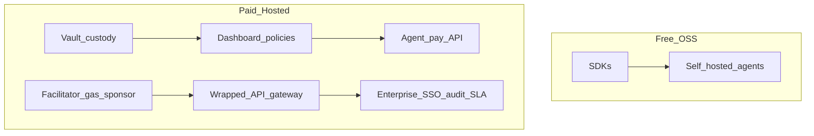

# Monetization — open-core SDK + hosted platform

**Purpose:** Define what is free in open source vs what AlgoPay charges for on the hosted control plane. Semifinal / investor-ready summary.

**Navigation:** [Control plane](CONTROL_PLANE.md) · [Platform feature matrix](../PLATFORM_FEATURE_MATRIX.md) · [Publishing](../PUBLISHING.md)

---

## Model

**Open Core + Usage** — same pattern as x402 ecosystem infrastructure (Coinbase facilitator, Nodit pay-per-use APIs, Nevermined metering).

- **Free:** Client libraries and self-hosted agent signing (top of funnel, adoption, community).
- **Paid:** Hosted custody, team policies, settlement, compliance, and API gateway (where operational cost and liability sit).

One-liner for judges:

> SDK is free like Stripe's client libraries; we charge for the hosted control plane, settlement, and enterprise governance.

---

## Free forever (OSS)

| Capability | Package |
|------------|---------|
| Python SDK | PyPI `algopay-sdk` |
| TypeScript SDK | npm `@algodev-studio/algopay` |
| Guards (6 types), ledger, intents, batch | Both SDKs |
| x402 client (`x402-avm` / `@x402-avm`) | Both SDKs |
| Self-hosted keys and signing | Bring your own wallet |
| Docs, examples, MkDocs site | This repo |

---

## Paid — hosted control plane (`pay/`)

| Capability | Why paid |
|------------|----------|
| Encrypted vault + hosted signing API | Custody, HSM/KMS ops, uptime |
| Multi-workspace RBAC | Team product |
| Dashboard policies + approval inbox UI | Operator UX |
| `POST /api/agent/pay` at scale | Infra + rate limits |
| Facilitator / gas sponsorship | Per-tx chain cost |
| Wrapped API gateway (planned) | Upstream secrets + billing |
| Audit export, SSO, SLA (enterprise) | Compliance sales |

---

## Proposed tiers (alpha — refine before billing goes live)

| Tier | Monthly | Includes |
|------|---------|----------|
| **Starter** | $0 | 1 workspace, 2 agent wallets, 1,000 agent-pay API calls/mo, basic policies |
| **Builder** | $39 | 10 wallets, 25K API calls, webhooks, justification required, email support |
| **Team** | $149 | Unlimited wallets, 100K calls, approval queue UI, Redis shared guards, audit CSV export |
| **Enterprise** | Custom | SSO, KMS/HSM, SLA, sanctions screening, dedicated facilitator |

### Usage add-ons

| Add-on | Pricing | Reference |
|--------|---------|-----------|
| Settlement / facilitator | 1,000 tx free/mo, then **$0.001/tx** | [Coinbase CDP facilitator](https://docs.cdp.coinbase.com/x402/core-concepts/facilitator) |
| Gas sponsorship | Pass-through ALGO + ~10% markup | Operator covers agent gas |
| Wrapped API gateway (future) | Upstream cost + **5–15%** | Nodit-style pay-per-call |

---

## Open-core boundary diagram

---

## Who pays

1. **Agent builders** — hosted console when they do not want to manage keys (Starter → Builder).
2. **Teams / startups** — approval workflows, audit, shared guards (Team).
3. **Enterprises** — compliance, SSO, SLAs (Enterprise).
4. **API sellers** (future) — wrapped gateway take rate when catalog ships.

---

## Competitive alignment

| Player | What they monetize | AlgoPay parallel |
|--------|-------------------|------------------|
| Coinbase CDP | Facilitator settlement fees | Settlement fee on hosted facilitator |
| Nodit | Pay-per-use blockchain data APIs | Wrapped API gateway markup |
| Nevermined | Metering + 1–2% per tx | Team/Enterprise policy + metering |
| Karl Hughes OSS patterns | Hosted product + open core | Free SDK, paid `pay/` console |

---

## What we do not charge for

- Protocol usage (x402 is open)
- Self-hosted SDK deployments
- Contributing to the GitHub repo
- TestNet development

---

## Semifinal honesty notes

- Billing is **not implemented** in the console yet — tiers above are the **planned** commercial model.
- Alpha status: ship adoption and design-partner feedback before turning on Stripe.
